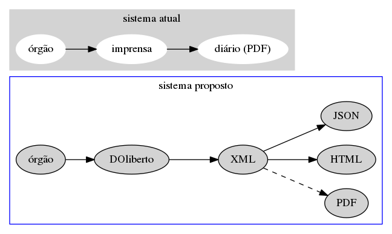

---
# to compile you need xelatex and pandoc
# run pandoc -t beamer -o slides-doliberto.pdf --latex-engine=xelatex slides.md
author: "bruno cuconato"
title: "diário liberto (DOliberto)"
subtitle: "um diário oficial verdadeiramente digital"
institute: "Laboratório de Políticas Públicas da FGV"
header-includes: 
    - \usepackage{polyglossia} 
    - \setmainlanguage{portuges}
    - \usepackage{hyperref}
    - \hypersetup{colorlinks=true, linkcolor=blue, linkbordercolor=blue}
---

# Diário Oficial no Brasil

Não vai existir transparência governamental no Brasil enquanto o
diário oficial não for transparente.

> - informações importantes e exclusivas

> - mas conteúdo em PDF

> - sem indexação: BARSA vs. Wikipédia

# Iniciativas Relacionadas

> - [diário livre](http://devcolab.each.usp.br/do/)

> - [queriDO](https://github.com/okfn-brasil/queriDO)

> - [TrazDia](https://github.com/andresmrm/trazdia)

# Iniciativas Relacionadas

## por que essa abordagem não funciona?

# Problemas
	
> - Cada diário é de um jeito

> - Diários mudam

> - PDF não é o formato correto

> - Diário Oficial não é consistente

# Problemas

## se adaptar ao meio ou mudá-lo?

# Diferencial DOliberto

**objetivos:**

> - criar um padrão aberto (subordinado
  ao [LeXML](http://www.leXML.gov.br/)) para intercâmbio,
  identificação e estruturação das informações contidas nos diários
  oficiais, que seja legível por humanos e computadores.
  
> - facilitar a elaboração de um D.O. *consistente* simplificando o
  trabalho do servidor público e reduzindo os erros.
  
> - versionar as informações disponibilizadas pelo D.O.: sem
  possibilidade de obter informações desatualizadas.

# Diferencial DOliberto

Como:

> - GUI: interface gráfica simples para a entrada dos dados
> - Server: indexação e busca, website, APIs

# workflow

*workflow* planejado:

> - [Cliente]: servidor do público trabalhando no seu órgão usa
  aplicativo que permite escolher os tipos de publicação
  
  > - É preciso fazer um levantamento dos tipos existentes (decretos,
    leis, nomeações, updates de processo, etc.)
	
> - ao selecionar um tipo, aparecem os campos que devem ser preenchidos.

> - preenchidos os campos, os valores são transformados para o formato
  XML, que é enviado ao Server, a cargo da secretaria que publica o
  D.O.

# workflow planejado

> - [Server]: o XML é recebido e tratado, e é construído um valor de
  identificação única (a URN, especificada pelo leXML) para cada
  publicação a partir de seu conteúdo.
  
  > - e.g.,
    ```
	br:rio.de.janeiro;rio.de.janeiro:municipal:
	{orgao}:{tipo};{data};{nr}
	```
    é uma URN, em que os campos entre \{chaves\} são específicos de cada
    publicação, e os outros campos são variáveis globais para a
    prefeitura do rio de janeiro.
	
> - ao final do dia é construído o arquivo final do diário, usando os
  XML's recebidos.

# workflow



# Desafios

> - político

> - técnico

# Desafios

**é possível**: exemplo
do [Federal Register](https://www.archives.gov/developer) americano.

# Conclusão

## Perguntas?


# Contato

## LABFGV

[site](https://www.labfgv.com), [facebook](https://www.facebook.com/labfgv), [github](https://github.com/labFGV).

Essa apresentação é oferecida com uma licença [Creative Commons Attribution 4.0 International](http://creativecommons.org/licenses/by/4.0/).
