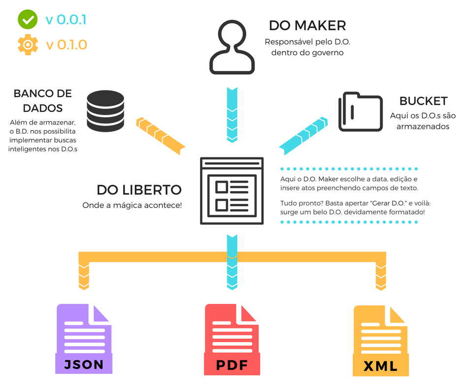

---
---

O DOliberto é uma plataforma gratuita em código aberto para a produção
de Diários Oficiais transparentes e multiformatos.

- TOC
{:toc}

## Um Diário Oficial verdadeiramente digital
O poder público produz mais informações do que uma pessoa (ou mesmo um
grupo!) pode acompanhar. Da tramitação de projetos nas câmaras
legislativas às portarias das agências reguladoras, **diversas normas
são propostas sem a plena participação popular**.

O governo publica seus atos por meio dos Diários Oficiais, que tem,
por isso, papel central na transparência da atividade
pública. Acompanhar e fiscalizar a grande quantidade de informações
presentes nos documentos é praticamente inviável sem o uso de
computadores que filtrem e analisem esses dados. **Dessa forma,
disponibilizar todo documento legal e governamental de maneira
acessível a pessoas e a computadores torna-se fundamental para o
processo democrático.**

Nesse contexto, o projeto DOliberto almeja tornar mais fácil a criação
de um Diário Oficial acessível e transparente.

## DOliberto: como funciona?
O projeto se baseia na premissa de que muitos tipos de atos publicados
em <abbr title="Diários Oficiais">DOs</abbr> apresentam poucas
variações, de modo que podem ser escritos de maneira mais
automatizada.

Tomemos como exemplo o
[ato](http://www.imprensanacional.gov.br/materia/-/asset_publisher/2eV0Indlhjp7/content/id/699534)
abaixo:

>    O PRESIDENTE DA REPÚBLICA, no uso da atribuição que lhe confere o
>    art. 84, caput, inciso XXV, da Constituição, e tendo em vista o
>    disposto no art. 77, caput, inciso I, alínea "c", e no art. 79 do
>    Anexo I ao Decreto nº 8.817, de 21 de julho de 2016, e no
>    art. 18, caput, inciso I, do Regulamento de Pessoal do Serviço
>    Exterior, aprovado pelo Decreto nº 93.325, de 1º de outubro de
>    1986, resolve
>
>    NOMEAR
>
>    ENIO CORDEIRO, Ministro de Primeira Classe da Carreira de
>    Diplomata do Ministério das Relações Exteriores, para exercer o
>    cargo de Cônsul-Geral do Brasil em Nova Iorque, Estados Unidos da
>    América, removendo-o, ex officio, da Embaixada do Brasil na
>    Cidade do México, Estados Unidos Mexicanos.
>
>    Brasília, 1º de dezembro de 2017; 196º da Independência e 129º da
>    República.
>
>    Aloysio Nunes Ferreira Filho

Seguem duas nomeações de mesmo teor, em que há apenas três variáveis:
a pessoa nomeada, o cargo que ela ocupava e o novo cargo a ser
ocupado. Bastam essas informações para descrever completamente o texto
dos atos em questão, o que nos permite produzí-lo texto a partir
desses três dados.

Na abordagem do DOliberto, uma interface gráfica simples pergunta à
escritora o tipo de notícia que ela deseja redigir; com base na
resposta, pergunta-se em seguida as variáveis do ato em questão e o
texto é produzido automaticamente a partir desses dados, em um
processo denominado em inglês por *document automation*.

**Naturalmente, nem todo ato presta-se a esse tipo de automação**. No
caso caso das leis, por exemplo, o DOliberto apenas oferece um campo
livre de escrita, automatizando somente as partes mais básicas do ato,
como a data, título e as informações do autor.

## Vantagens
- **correção**: Redução de erros nas publicações;
- **eficiência**: Links entre matérias relacionadas e versões do mesmo
  documento;
- **transparência**: Acesso livre ao texto: buscas simples e
  eficientes, sistemas de alertas;
- **multiformato**: um formato pra cada atividade: leitura *online*
  (HTML), leitura *offline* (PDF), análise (XML, JSON).
- **conectado**: Versionar e interligar as publicações que modifiquem
  outras.

## Status
O DOliberto, em desenvolvimento, está na versão `0.0.1`. O esquema
abaixo resume as etapas já implementadas e quais ainda estão para
serem desenvolvidas. Para mais detalhes, entre em contato conosco, ou
veja nosso [GitHub](https://github.com/labFGV/DOliberto/issues/36).

## FAQ

### O que é Diário Oficial?
Os Diários Oficiais são jornais mantidos por governos para publicar
todos os atos realizados pela administração pública, como as leis, os
decretos, as nomeações e os editais de licitação. No Brasil, possuem
Diário Oficial o Governo Federal, os Estados, os municípios e os
órgãos do Poder Judiciário.

### O que é o DOliberto?
O DOliberto é uma plataforma gratuita em código aberto para a produção
de Diários Oficiais transparentes e multiformatos.

### Quem faz o DOliberto?
O DOliberto é um projeto do
[LABFGV](http://labfgv.com.br/diario-oficial-liberto/), entidade
estudantil que busca soluções inovadoras para a melhoria da gestão
pública do país.

Nossa equipe principal é formada por estudantes de graduação e
mestrado, em Matemática Aplicada e Direito, que fazem parte do LABFGV
como membros ou fellows. No entanto, aceitamos contribuições externas!

### Quanto custa utilizar o DOliberto?

Nada! Todo o código do projeto é *open source* e, portanto, aberto
para a comunidade. O custo é zero e há benefícios tanto para a
[administração pública](./poder-publico.html#vantagens-do-doliberto)
quanto para a [sociedade](./#vantagens).

### Posso adotar o DOli e continuar a imprimir o DO?

Sim! O DOli gera uma versão em PDF do Diário Oficial pronta para
impressão. Caso um município deseje extinguir a versão impressa de seu
Diário Oficial e manter apenas a digital, pode ser necessário realizar
[alterações normativas](./poder-publico.html#adoção).

### Qual a diferença entre o DOliberto e outros DOs digitais?
- **Acesso aos dados**: no momento (Dezembro 2017), os sites dos
  Diários Oficiais da União, de São Paulo e do Rio de Janeiro não
  permitem baixar os dados de todas as publicações como um todo,
  impedindo o usuário de fazer com os dados o que desejar, como criar
  seu próprio sistema de busca.

- **Dados estruturados**: os formatos JSON e XML (usados pelo
  DOliberto) podem registrar que uma notícia é de determinada
  secretaria ou que um valor em reais representa o total de uma
  licitação de maneira compreensível para um computador. Esses
  procedimentos não são possíveis em PDF e são complicados em HTML,
  porque esses formatos (usados pelos DOs brasileiros) representam
  informação de modo desestruturado. A representação desestruturada
  dificulta a análise dos textos em larga escala, prejudicando a
  transparência governamental.

- **Código aberto**: o DOliberto é uma iniciativa de código aberto, de
  modo que qualquer prefeitura do país (e não só as mais ricas) pode
  implantar um sistema moderno de Diário Oficial com custo zero. O
  código livre também permite a qualquer pessoa personalizar o
  DOliberto para os seus fins, e também contribuir melhorias para o
  sistema.

### De que forma eu posso ajudar o projeto?

Qualquer ajuda é bem vinda! Dependendo de suas habilidades, existem
diferentes maneiras de contribuir: como cidadão, você pode sugerir
para seus representantes políticos a adoção do DOli na sua cidade; se
você é programador, temos uma [página especial](./dev.html) para
você. Se deseja contribuir de alguma forma (design, divulgação,
documentação...), entre em
[contato](mailto:labfgv+doliberto@gmail.com) conosco. Ficaremos muito
felizes com seu contato!

